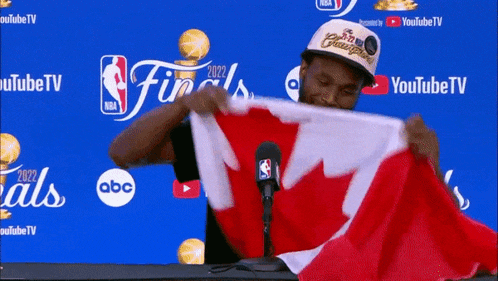

With the signing of Juan Soto's record setting 15 year, $765 million contract, I was curious how this number compared to the rest of the salaries in the MLB, as well as those across each of the Big Four American sports. 

The contract information for each MLB, NBA, NFL, and NHL player is available on [https://www.spotrac.com/](https://www.spotrac.com/). To create these plots, I scraped the site using the Python library `BeautifulSoup` and collected all individual player AAV's and contract lengths. I used these to create histograms, which I have plotted as smooth kernel density estimations.

It's fascinating how different the spread of AAV's are in each league. The NBA's is starkly different from the rest, with a long tail and a broad belly. The NBA is the smallest of the four leagues, as well as the leauge where individual players have the most impact. Perhaps this creates a market where it can be justified to give any contract to anybody? Fred VanVleet could organize our young core? $43 million should do! Jonathan Issac has DPOY potential? $25 million! Brandon Ingram is a proffesional scorer? $36 million! John Collins jumped over a plane in a dunk contest? $27 million!
If you squint your eyes, you can see why X team gave out Y contract to Z player, even if its looks horrible in hindsight (well, except for a [few](https://en.wikipedia.org/wiki/Timofey_Mozgov#Los_Angeles_Lakers_(2016%E2%80%932017))). In the NBA it can be worth it to take the risk becuase sometimes, something will click, and that bad contract may actually be just fine.

{:style="display:block; margin-left:auto; margin-right:auto"}

We can contrast that with the MLB, where the most widely used Sabermetric stat is literally called wins above *replacement*. There are so many players than can do an alright enough job that to really value a player, you need to compare them to what the [MLB defines as](https://www.mlb.com/glossary/advanced-stats/wins-above-replacement) as "a Minor League replacement or a readily available fill-in free agent." So someone not in the major leagues. Baseball is just as much about winning on the margins as it is about rostering the highest profile, highest paid stats (didn't someone write a book about this?). As a result, it's harder to justify giving out big money to someone who just may play at an All Star level; better to spread that money out a amongst your roster so that you don't put out an infield of replacement players.

The distribution of total contract values is a different story. There are a ton of high AAV contracts in the NBA, but they just aren't that long. As a result, the broad belly seen in the distribution of average annual salaries doesn't stand out here. The MLB, and the NFL to some extent, are composed mostly of short contracts with (relatively)small AAV's, so the total contract values are pretty sharply peaked below $50 million. But there are some clear outlier large constracts in these two leagues. Soto and Ohtani headline the list, but Mike Trout was really the first to do it. What strikes me about these three contracts is that no one really thinks of these are overpays. I think you can say the same thing about Patrick Mahomes. The "stars and studs" nature of roster building in the MLB and NFL means that only the elite of the elite get these mind-blowingly large contracts (unlike in the NBA, if you were to ask someone outside of Boston).

$$
\tilde{}
$$

